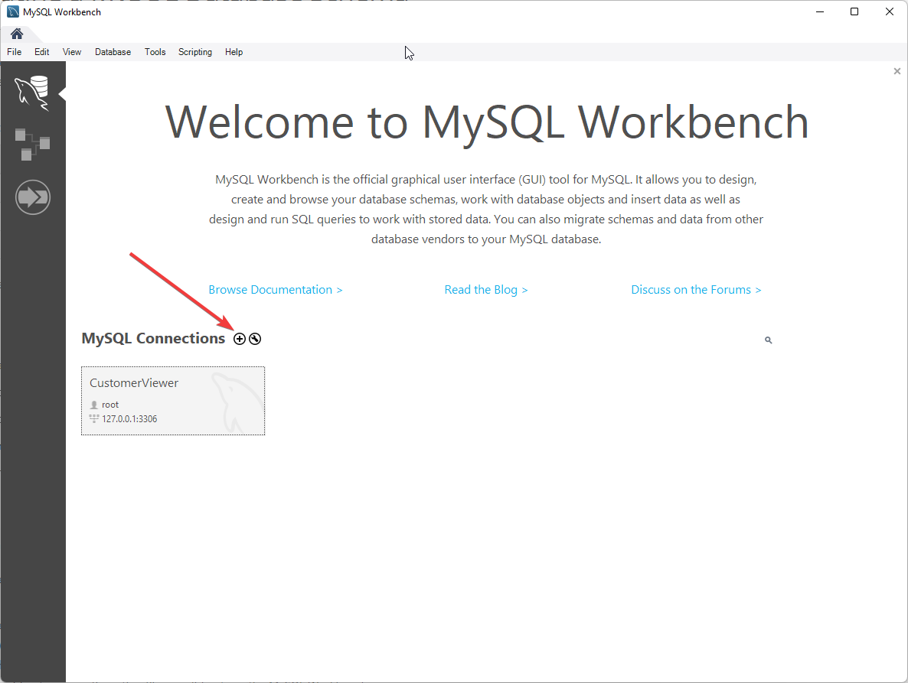
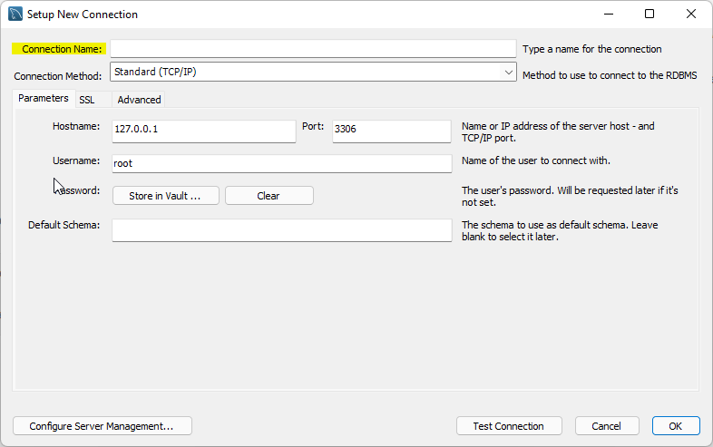
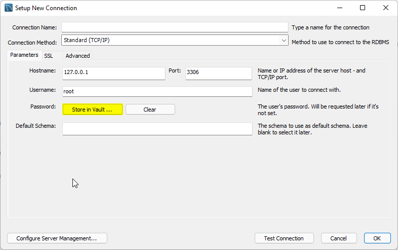
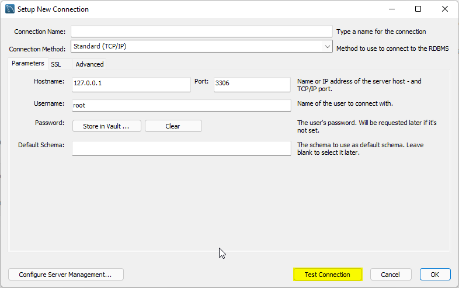
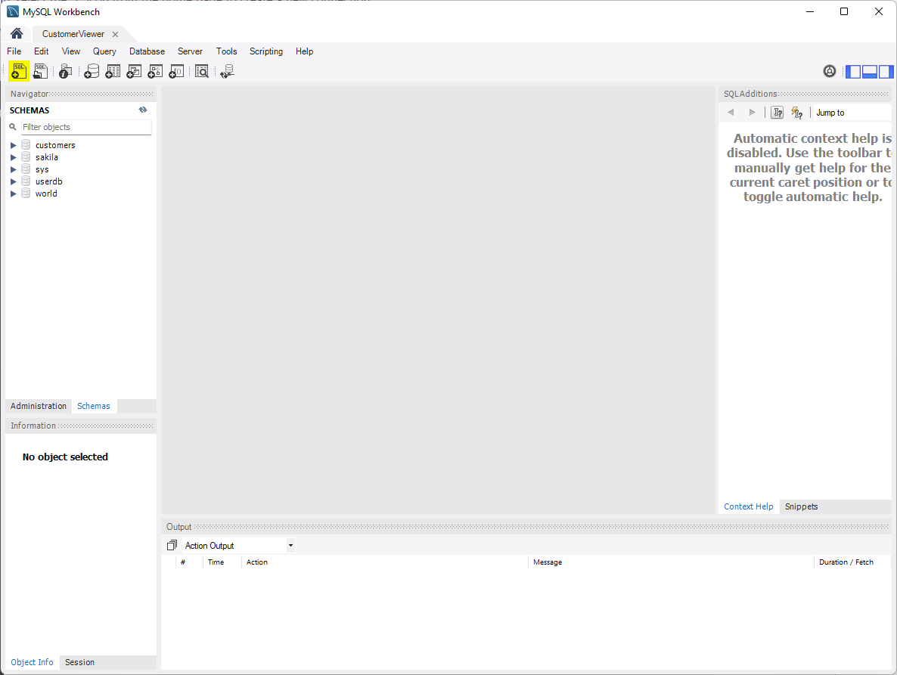
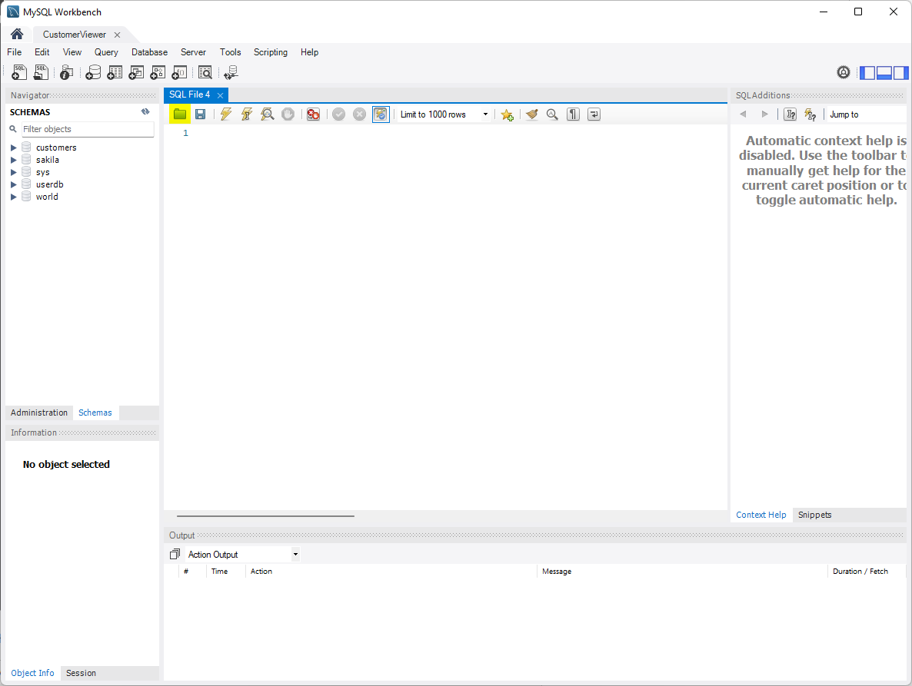
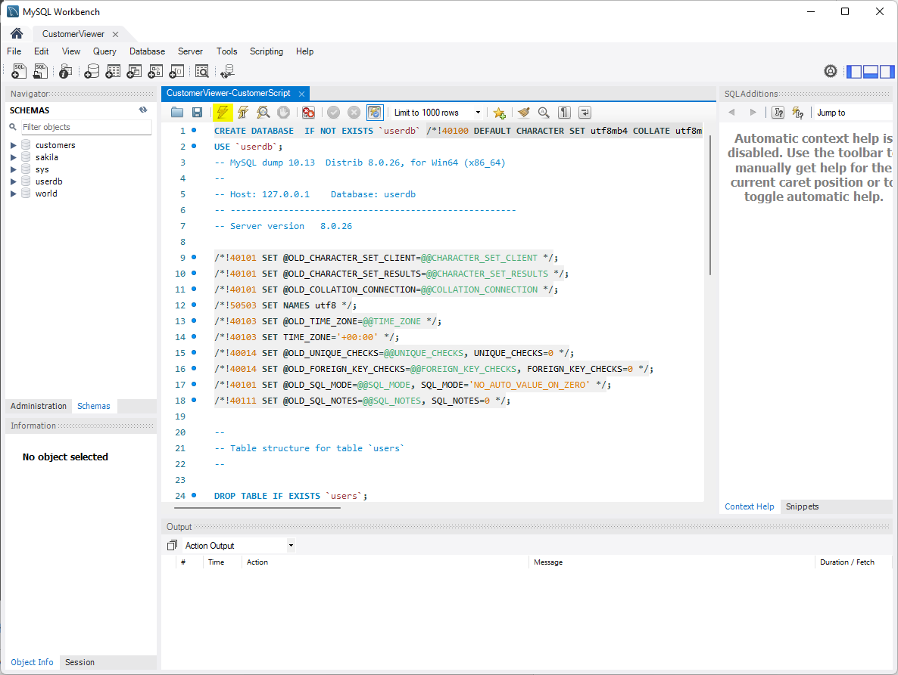

# **CustomerViewerAPI**
 This is a simple API that will allow you to Add, Delete, Modify and Get Customers from a database. This API will work with MySQL databases.

## Table of Contents
- [Creating the Database](https://github.com/browne878/CustomerViewerAPI#creating-the-database)
- [Preparing the API](https://github.com/browne878/CustomerViewerAPI#preparing-the-api)
- [Starting the API](https://github.com/browne878/CustomerViewerAPI#starting-the-api)
- [Requests](https://github.com/browne878/CustomerViewerAPI#requests)
  - [GET Request](https://github.com/browne878/CustomerViewerAPI#get-request)
  - [POST Request](https://github.com/browne878/CustomerViewerAPI#post-request)
  - [PUT Request](https://github.com/browne878/CustomerViewerAPI#put-request)
  - [DELETE Request](https://github.com/browne878/CustomerViewerAPI#delete-request)
- [POSTMAN Collection](https://github.com/browne878/CustomerViewerAPI#postman-collection)

## Creating the Database

In this section I will tell you how to set up a MySQL Database using MySQL Workbench. This database will run on local host so if you choose not 
to do this your setup process will differ to this.

I will assume that you have MySQL Workbench installed and set up for this process.

As we will only be creating a databse the setup procedure is very simple.

1. To begin, select the `+` icon from the home page to create a new connection.



2. Once the window is open, you can then select the name of the connection in the `Connection Name:` box shown below.



3. After this, you can then select a password by clicking the `Store in Vault` button.



4. As we are creating a database on localhost, we can leave all of the other options as they are. Just ensure that the port is the same as the one
you entered while you were setting up MySQL Workbench. You should then click the `Test Connection` button to ensure that everything entered is correct.



5. Next, you can click the `Ok` button to comeplete the process.

### OPTIONAL:

To create the database and tables required you can follow the instructions below

6. Now that you connection is created, you're going to want to double click to open the connection.

7. You will then need to open a new SQL Query Tab by clicking the button shown below.



8. After this, you will need to download the SQL Script from [here](CustomerViewer-CustomerScript.sql).

9. Once that has dowloaded, click the folder icon shown below and open the .sql file you just downloaded.



10. Finally, execute the script by clicking the lightning bolt.



This will create everything you need and add 10 customers to the database so that you can test that it is all working.

## Preparing the API
To begin, download the [this](https://github.com/browne878/CustomerViewerAPI/tree/main/bin/Release/net5.0) file. You will then want to configure the [Config File](https://github.com/browne878/CustomerViewerAPI/blob/main/bin/Release/net5.0/Config/Config.json) with the database information from the previous section.


## Starting the API
Once the API has been prepared then all you have to do is run the [CustomerViewerAPI](https://github.com/browne878/CustomerViewerAPI/blob/main/bin/Release/net5.0/CustomerViewerAPI.exe) application you dowloaded and the API will be running.

You can exit the application with `CTRL+C` while the console is selected.


## Requests


 Once you have the API started and the database set up, all GET requests should be made to the following address.

```
https://localhost:5001/customer/api/customers
```

### GET Request
A GET request to the following address will return an array of all the customers in JSON format.

```
https://localhost:5001/customer/api/customers
```

Alternatively, you can select a customer by their ID as show below.

```
https://localhost:5001/customer/api/customers/{ID}
```

### POST Request
A POST request will add a new customer to the database. A customer should be added my making a POST request to the following address with the
customer object, in JSON format, in the body of the POST.

```
https://localhost:5001/customer/api/customers
```

### PUT Request
A PUT request will update a customers information. This can be done by making a PUT request to the following address with the customer object,
in JSON format, in the body of the PUT.

```
https://localhost:5001/customer/api/customers
```

### DELETE Request
A DELETE request will remove a customer from the database. This can be done by making a DELETE request to the following address with the customer ID
in the body of the DELETE.

```
https://localhost:5001/customer/api/customers/{ID}
```

## POSTMAN Collection

I have compiled a list of useful request which can be easily accessed.

I have also included a POST request to allow you to populate the database with 10 customers to allow you to test the API is working correctly.

You can import the collection with this [file](CustomerViewerAPI_Collection.json).
